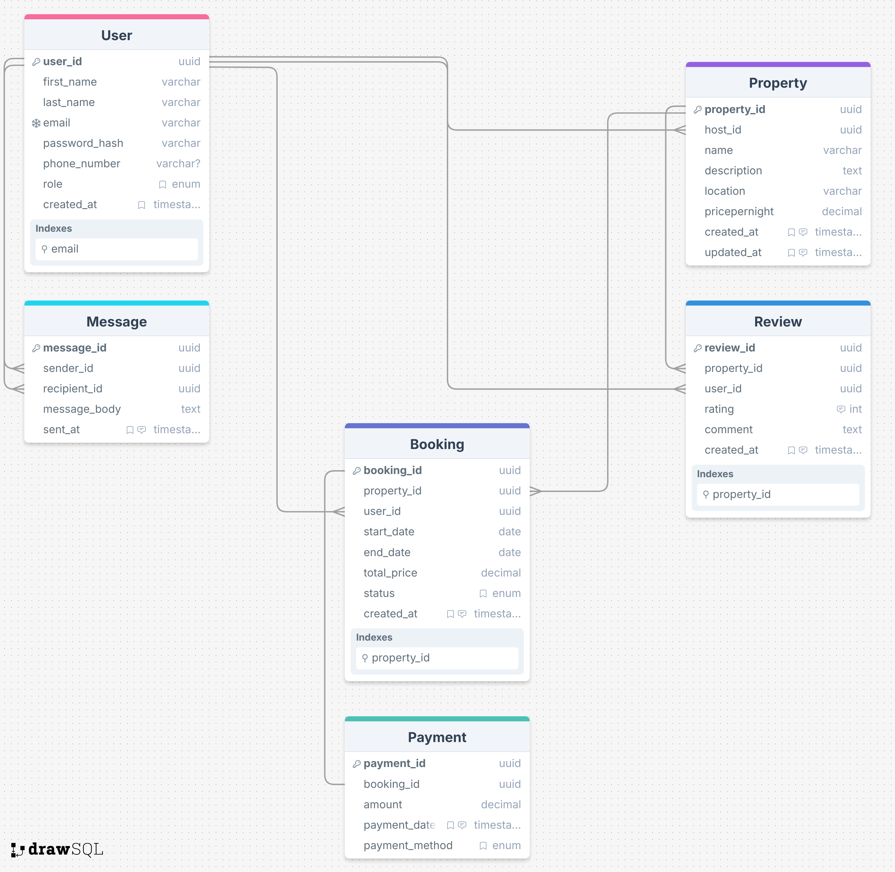

# Airbnb Database ER Diagram

The diagram below represents the structure of the Airbnb database, showing entities, attributes, and relationships.

## **Entities, Attributes, and Cardinalities**

| Entity       | Attributes                                                                                                                                                            | Relationships                                                                           | Cardinality                                                                                                                                          |
| ------------ | --------------------------------------------------------------------------------------------------------------------------------------------------------------------- | --------------------------------------------------------------------------------------- | ---------------------------------------------------------------------------------------------------------------------------------------------------- |
| **User**     | `user_id` (PK), `first_name`, `last_name`, `email` (unique), `password_hash`, `phone_number`, `role` (guest/host/admin), `created_at`                                 | - Hosts Properties - Makes Bookings - Writes Reviews - Sends/Receives Messages | - User → Property: 1:N - User → Booking: 1:N - User → Review: 1:N - User → Message: 1:N (as sender) - User → Message: 1:N (as recipient) |
| **Property** | `property_id` (PK), `host_id` (FK → User), `name`, `description`, `location`, `pricepernight`, `created_at`, `updated_at`                                             | - Has Bookings - Receives Reviews - Hosted by User                                | - Property → Booking: 1:N - Property → Review: 1:N - User → Property: 1:N                                                                      |
| **Booking**  | `booking_id` (PK), `property_id` (FK → Property), `user_id` (FK → User), `start_date`, `end_date`, `total_price`, `status` (pending/confirmed/canceled), `created_at` | - Linked to Property - Linked to User - Can have Payments                         | - Booking → Payment: 1:1 (or 1:N if multiple payments allowed) - User → Booking: 1:N - Property → Booking: 1:N                                 |
| **Payment**  | `payment_id` (PK), `booking_id` (FK → Booking), `amount`, `payment_date`, `payment_method` (credit_card/paypal/stripe)                                                | - Linked to Booking                                                                     | - Booking → Payment: 1:1 (or 1:N)                                                                                                                    |
| **Review**   | `review_id` (PK), `property_id` (FK → Property), `user_id` (FK → User), `rating` (1-5), `comment`, `created_at`                                                       | - Written by User - About Property                                                   | - User → Review: 1:N - Property → Review: 1:N                                                                                                     |
| **Message**  | `message_id` (PK), `sender_id` (FK → User), `recipient_id` (FK → User), `message_body`, `sent_at`                                                                     | - Sent from User - Received by User                                                  | - User → Message: 1:N (as sender) - User → Message: 1:N (as recipient)                                                                            |

---

### **Relationship Summary (Cardinalities)**

1. **User → Property (host)**: 1:N
2. **User → Booking**: 1:N
3. **Property → Booking**: 1:N
4. **Booking → Payment**: 1:1 (or 1:N if multiple payments allowed)
5. **User → Review**: 1:N
6. **Property → Review**: 1:N
7. **User → Message (sent)**: 1:N
8. **User → Message (received)**: 1:N

---

### **Indexes & Constraints**

* **Primary keys**: all entities.
* **Unique**: `email` in User.
* **Foreign keys**:

  * Property → User (`host_id`)
  * Booking → Property (`property_id`)
  * Booking → User (`user_id`)
  * Payment → Booking (`booking_id`)
  * Review → Property (`property_id`)
  * Review → User (`user_id`)
  * Message → User (`sender_id`, `recipient_id`)
* **Check constraints**: Review rating 1–5, Booking status enum, Payment method enum.
* **Additional indexes**: email in User, property_id in Property/Booking, booking_id in Booking/Payment.
